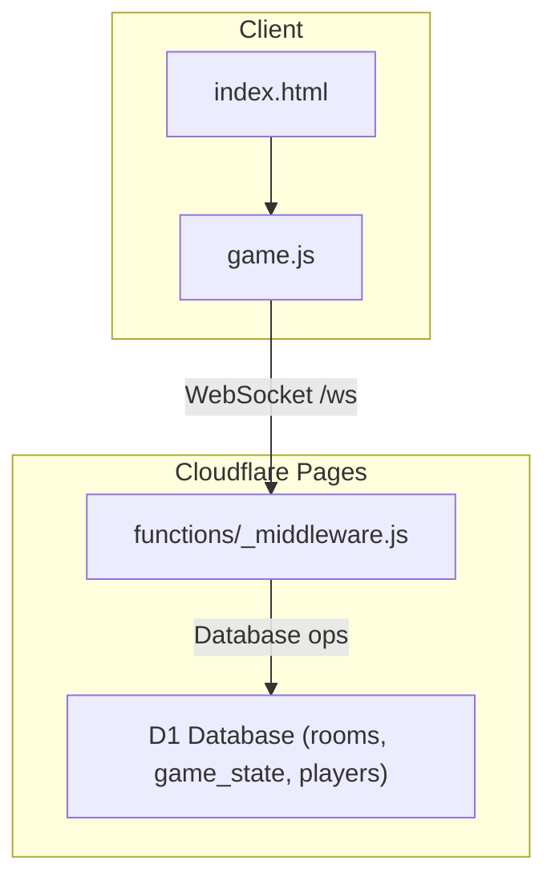
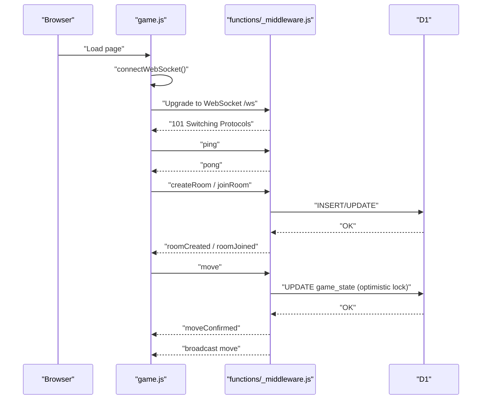
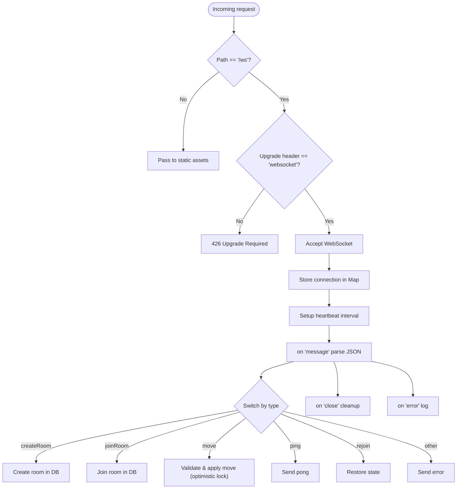
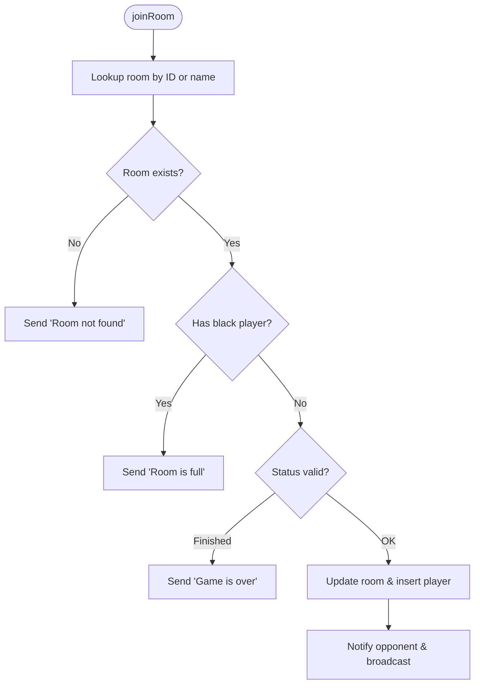
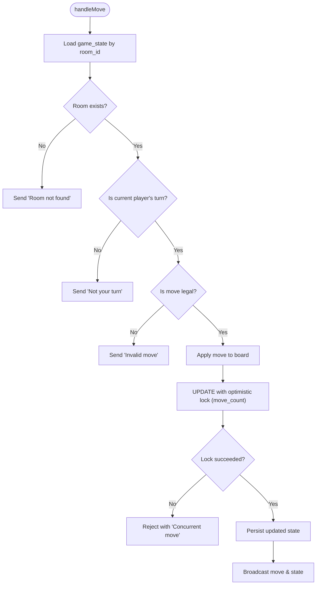
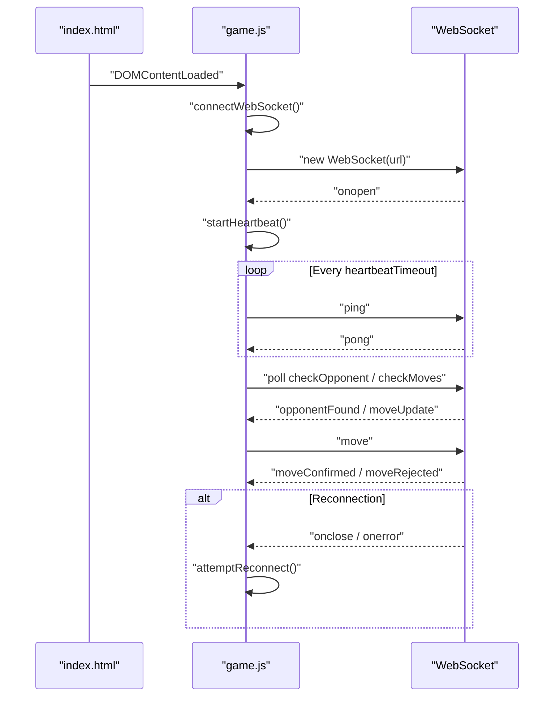
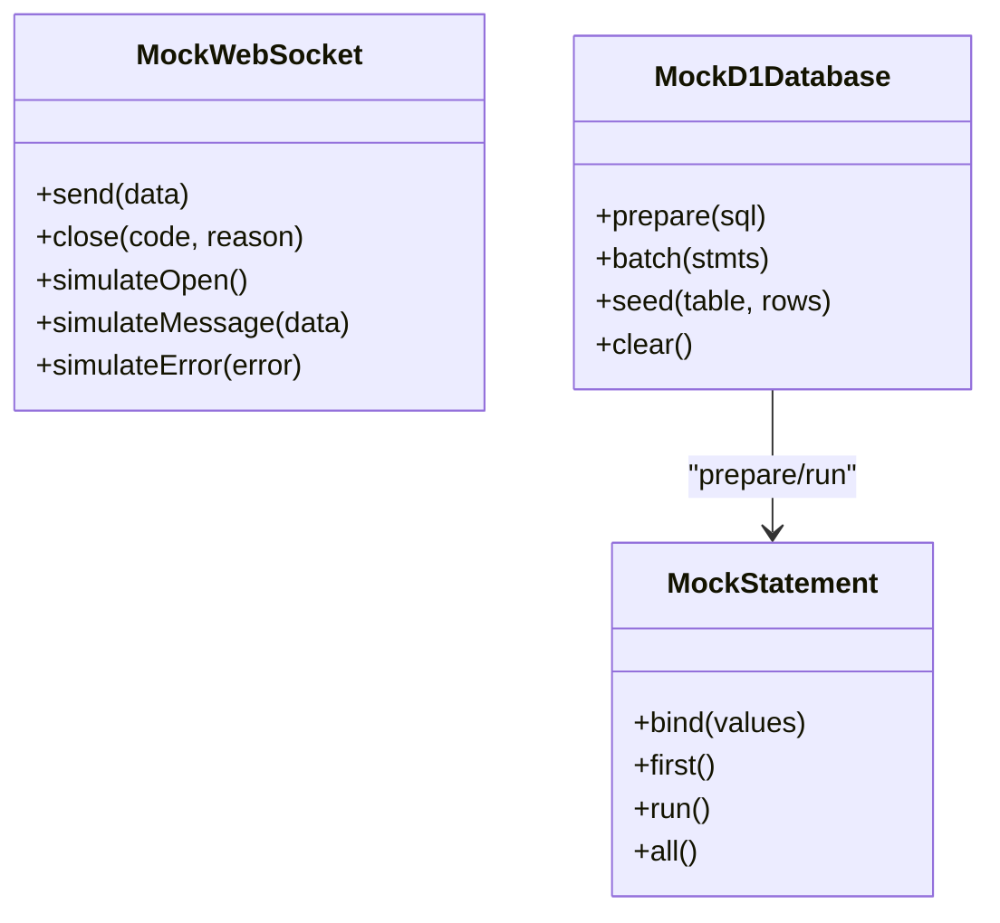
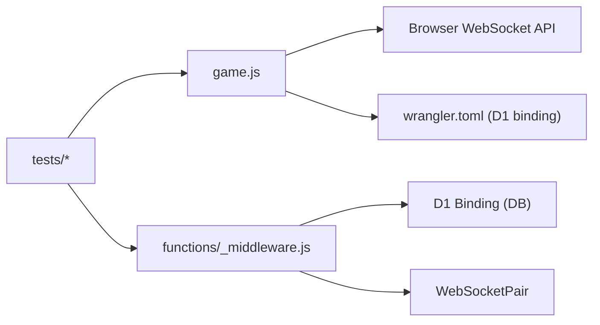

# Debugging and Monitoring

<cite>
**Referenced Files in This Document**
- [functions/_middleware.js](file://functions/_middleware.js)
- [game.js](file://game.js)
- [tests/integration/websocket.test.js](file://tests/integration/websocket.test.js)
- [tests/debug/move-debug.test.js](file://tests/debug/move-debug.test.js)
- [tests/setup.js](file://tests/setup.js)
- [TROUBLESHOOTING.md](file://TROUBLESHOOTING.md)
- [wrangler.toml](file://wrangler.toml)
- [package.json](file://package.json)
- [index.html](file://index.html)
- [schema.sql](file://schema.sql)
</cite>

## Table of Contents
1. [Introduction](#introduction)
2. [Project Structure](#project-structure)
3. [Core Components](#core-components)
4. [Architecture Overview](#architecture-overview)
5. [Detailed Component Analysis](#detailed-component-analysis)
6. [Dependency Analysis](#dependency-analysis)
7. [Performance Considerations](#performance-considerations)
8. [Troubleshooting Guide](#troubleshooting-guide)
9. [Conclusion](#conclusion)
10. [Appendices](#appendices)

## Introduction
This document provides comprehensive guidance for debugging and monitoring WebSocket-based real-time interactions in a Cloudflare Workers/Pages environment. It covers server-side logging patterns, connection tracking, message flow monitoring, client-side debugging with browser developer tools, and practical troubleshooting strategies for common issues such as connection timeouts, message delivery failures, and state synchronization problems. It also outlines production monitoring, alerting strategies, and operational dashboards.

## Project Structure
The project is organized around a Cloudflare Pages frontend and a Cloudflare Workers middleware that upgrades HTTP requests to WebSocket connections, manages rooms and game state via a D1 database, and broadcasts real-time updates to clients. Testing utilities and scripts support local development and debugging.

**Diagram sources**
- [functions/_middleware.js:104-122](file://functions/_middleware.js#L104-L122)
- [game.js:740-808](file://game.js#L740-L808)
- [wrangler.toml:14-17](file://wrangler.toml#L14-L17)

**Section sources**
- [functions/_middleware.js:104-122](file://functions/_middleware.js#L104-L122)
- [game.js:740-808](file://game.js#L740-L808)
- [wrangler.toml:14-17](file://wrangler.toml#L14-L17)

## Core Components
- Server-side WebSocket handler and heartbeat management
- Room lifecycle and database-backed state
- Client-side WebSocket connection, reconnection, heartbeat, and polling fallbacks
- Logging and error signaling for diagnostics
- Test utilities simulating WebSocket and database behavior

Key implementation references:
- Server request routing and WebSocket upgrade: [functions/_middleware.js:104-122](file://functions/_middleware.js#L104-L122)
- WebSocket connection lifecycle and heartbeat: [functions/_middleware.js:131-185](file://functions/_middleware.js#L131-L185), [functions/_middleware.js:191-225](file://functions/_middleware.js#L191-L225)
- Room creation/join/leave and stale room cleanup: [functions/_middleware.js:282-516](file://functions/_middleware.js#L282-L516)
- Game move validation and optimistic locking: [functions/_middleware.js:522-683](file://functions/_middleware.js#L522-L683)
- Client-side connection, heartbeat, polling, and message handling: [game.js:740-1040](file://game.js#L740-L1040), [game.js:1170-1234](file://game.js#L1170-L1234)

**Section sources**
- [functions/_middleware.js:131-185](file://functions/_middleware.js#L131-L185)
- [functions/_middleware.js:282-516](file://functions/_middleware.js#L282-L516)
- [functions/_middleware.js:522-683](file://functions/_middleware.js#L522-L683)
- [game.js:740-1040](file://game.js#L740-L1040)
- [game.js:1170-1234](file://game.js#L1170-L1234)

## Architecture Overview
The WebSocket flow integrates client UI, client-side logic, server middleware, and D1 persistence. The server maintains per-instance connection state and uses database-backed state for rooms and game state. Clients implement heartbeat and polling fallbacks to maintain synchronization.

**Diagram sources**
- [functions/_middleware.js:131-185](file://functions/_middleware.js#L131-L185)
- [functions/_middleware.js:282-351](file://functions/_middleware.js#L282-L351)
- [functions/_middleware.js:353-443](file://functions/_middleware.js#L353-L443)
- [functions/_middleware.js:522-683](file://functions/_middleware.js#L522-L683)
- [game.js:740-808](file://game.js#L740-L808)
- [game.js:888-937](file://game.js#L888-L937)

## Detailed Component Analysis

### Server-Side WebSocket Handler and Heartbeat
- Accepts WebSocket upgrades and initializes database on first use.
- Tracks connections in memory per instance and enforces heartbeat intervals.
- Handles typed messages (createRoom, joinRoom, move, ping/pong, rejoin, etc.) with robust error signaling.
- Implements stale room cleanup and graceful disconnect handling.

**Diagram sources**
- [functions/_middleware.js:104-122](file://functions/_middleware.js#L104-L122)
- [functions/_middleware.js:131-185](file://functions/_middleware.js#L131-L185)
- [functions/_middleware.js:191-225](file://functions/_middleware.js#L191-L225)
- [functions/_middleware.js:231-276](file://functions/_middleware.js#L231-L276)
- [functions/_middleware.js:282-351](file://functions/_middleware.js#L282-L351)
- [functions/_middleware.js:353-443](file://functions/_middleware.js#L353-L443)
- [functions/_middleware.js:522-683](file://functions/_middleware.js#L522-L683)

**Section sources**
- [functions/_middleware.js:131-185](file://functions/_middleware.js#L131-L185)
- [functions/_middleware.js:191-225](file://functions/_middleware.js#L191-L225)
- [functions/_middleware.js:231-276](file://functions/_middleware.js#L231-L276)
- [functions/_middleware.js:282-351](file://functions/_middleware.js#L282-L351)
- [functions/_middleware.js:353-443](file://functions/_middleware.js#L353-L443)
- [functions/_middleware.js:522-683](file://functions/_middleware.js#L522-L683)

### Room Lifecycle and Stale Cleanup
- Room creation validates uniqueness and cleans stale rooms before reuse.
- Room joining enforces capacity and status checks.
- Stale room detection uses counters and time windows to decide cleanup.

**Diagram sources**
- [functions/_middleware.js:353-443](file://functions/_middleware.js#L353-L443)
- [functions/_middleware.js:479-516](file://functions/_middleware.js#L479-L516)

**Section sources**
- [functions/_middleware.js:353-443](file://functions/_middleware.js#L353-L443)
- [functions/_middleware.js:479-516](file://functions/_middleware.js#L479-L516)

### Game Move Validation and Optimistic Locking
- Validates turns, piece ownership, and move legality.
- Applies move atomically using optimistic locking on move_count.
- Broadcasts move and game state updates; handles check/checkmate and win conditions.

**Diagram sources**
- [functions/_middleware.js:522-683](file://functions/_middleware.js#L522-L683)

**Section sources**
- [functions/_middleware.js:522-683](file://functions/_middleware.js#L522-L683)

### Client-Side WebSocket, Heartbeat, and Polling
- Establishes WebSocket connection with protocol-aware URL.
- Implements exponential backoff reconnection and heartbeat monitoring.
- Uses polling fallbacks for opponent presence and move synchronization.
- Handles authoritative server messages and rollbacks on rejection.

**Diagram sources**
- [game.js:740-808](file://game.js#L740-L808)
- [game.js:842-882](file://game.js#L842-L882)
- [game.js:1170-1234](file://game.js#L1170-L1234)
- [game.js:888-937](file://game.js#L888-L937)

**Section sources**
- [game.js:740-808](file://game.js#L740-L808)
- [game.js:842-882](file://game.js#L842-L882)
- [game.js:1170-1234](file://game.js#L1170-L1234)
- [game.js:888-937](file://game.js#L888-L937)

### Testing Utilities and Debugging Aids
- Mock WebSocket and D1 database for unit and integration tests.
- Test suites covering connection, message handling, room operations, move synchronization, heartbeat, error handling, reconnection, and disconnection.
- Move-debug tests to isolate and validate chess move logic.

**Diagram sources**
- [tests/setup.js:8-62](file://tests/setup.js#L8-L62)
- [tests/setup.js:65-170](file://tests/setup.js#L65-L170)

**Section sources**
- [tests/integration/websocket.test.js:12-27](file://tests/integration/websocket.test.js#L12-L27)
- [tests/integration/websocket.test.js:33-67](file://tests/integration/websocket.test.js#L33-L67)
- [tests/integration/websocket.test.js:69-125](file://tests/integration/websocket.test.js#L69-L125)
- [tests/integration/websocket.test.js:127-226](file://tests/integration/websocket.test.js#L127-L226)
- [tests/integration/websocket.test.js:228-277](file://tests/integration/websocket.test.js#L228-L277)
- [tests/integration/websocket.test.js:279-305](file://tests/integration/websocket.test.js#L279-L305)
- [tests/integration/websocket.test.js:307-342](file://tests/integration/websocket.test.js#L307-L342)
- [tests/integration/websocket.test.js:344-377](file://tests/integration/websocket.test.js#L344-L377)
- [tests/integration/websocket.test.js:379-403](file://tests/integration/websocket.test.js#L379-L403)
- [tests/debug/move-debug.test.js:106-261](file://tests/debug/move-debug.test.js#L106-L261)
- [tests/setup.js:8-62](file://tests/setup.js#L8-L62)
- [tests/setup.js:65-170](file://tests/setup.js#L65-L170)

## Dependency Analysis
- Client depends on browser WebSocket APIs and Cloudflare Pages hosting.
- Server depends on Cloudflare Workers runtime, D1 database binding, and the WebSocketPair API.
- Tests depend on Vitest and mock utilities to simulate runtime behavior.

**Diagram sources**
- [game.js:740-808](file://game.js#L740-L808)
- [functions/_middleware.js:131-144](file://functions/_middleware.js#L131-L144)
- [wrangler.toml:14-17](file://wrangler.toml#L14-L17)
- [tests/setup.js:173-177](file://tests/setup.js#L173-L177)

**Section sources**
- [game.js:740-808](file://game.js#L740-L808)
- [functions/_middleware.js:131-144](file://functions/_middleware.js#L131-L144)
- [wrangler.toml:14-17](file://wrangler.toml#L14-L17)
- [tests/setup.js:173-177](file://tests/setup.js#L173-L177)

## Performance Considerations
- Database latency: D1 responses should remain fast; monitor Cloudflare dashboard for latency trends.
- WebSocket round-trip: Keep heartbeat intervals reasonable to detect stalls early without overloading.
- Polling fallbacks: Use conservative intervals to avoid unnecessary load.
- Optimistic locking: Minimizes contention on move operations; ensure move_count comparisons are robust.

[No sources needed since this section provides general guidance]

## Troubleshooting Guide
Common issues and resolutions:
- Database not configured or unavailable
  - Verify D1 binding and database_id in configuration.
  - Ensure tables exist and indexes are present.
  - Check Cloudflare Dashboard for D1 status and logs.
- WebSocket connection fails or remains disconnected
  - Inspect browser console for WebSocket errors.
  - Confirm Functions logs show upgrade and heartbeat activity.
  - Validate deployment and route configuration.
- Moves not syncing or rejected
  - Check server logs for move validation errors.
  - Use client-side polling fallbacks to detect state drift.
  - Review optimistic locking behavior and concurrent move conflicts.
- Stale rooms and cleanup
  - Investigate stale room detection logic and cleanup triggers.
  - Ensure cleanup does not remove active rooms prematurely.

Diagnostic checklist and steps are documented in the project’s troubleshooting guide.

**Section sources**
- [TROUBLESHOOTING.md:13-252](file://TROUBLESHOOTING.md#L13-L252)
- [wrangler.toml:14-17](file://wrangler.toml#L14-L17)
- [schema.sql:5-42](file://schema.sql#L5-L42)

## Conclusion
The system combines robust server-side WebSocket handling with client-side resilience mechanisms. Comprehensive logging, heartbeat monitoring, and polling fallbacks enable effective debugging and monitoring. Production readiness requires careful attention to database health, connection stability, and state synchronization, supported by the included troubleshooting and testing resources.

[No sources needed since this section summarizes without analyzing specific files]

## Appendices

### A. Server-Side Logging Patterns
- Connection lifecycle: establish, heartbeat, close, error.
- Room operations: create, join, leave, stale cleanup.
- Game operations: move validation, optimistic locking, broadcast.
- Error signaling: structured error messages with codes and messages.

References:
- [functions/_middleware.js:157-179](file://functions/_middleware.js#L157-L179)
- [functions/_middleware.js:284-350](file://functions/_middleware.js#L284-L350)
- [functions/_middleware.js:355-442](file://functions/_middleware.js#L355-L442)
- [functions/_middleware.js:532-682](file://functions/_middleware.js#L532-L682)

**Section sources**
- [functions/_middleware.js:157-179](file://functions/_middleware.js#L157-L179)
- [functions/_middleware.js:284-350](file://functions/_middleware.js#L284-L350)
- [functions/_middleware.js:355-442](file://functions/_middleware.js#L355-L442)
- [functions/_middleware.js:532-682](file://functions/_middleware.js#L532-L682)

### B. Client-Side Debugging with Browser Developer Tools
- Network panel: inspect WebSocket upgrade, frames, and timing.
- Console: review connection state transitions, heartbeat misses, and error messages.
- Application panel: inspect local storage/session state if used.
- Performance panel: measure UI responsiveness during move operations.

References:
- [index.html:26-27](file://index.html#L26-L27)
- [game.js:756-783](file://game.js#L756-L783)
- [game.js:842-882](file://game.js#L842-L882)
- [game.js:888-937](file://game.js#L888-L937)

**Section sources**
- [index.html:26-27](file://index.html#L26-L27)
- [game.js:756-783](file://game.js#L756-L783)
- [game.js:842-882](file://game.js#L842-L882)
- [game.js:888-937](file://game.js#L888-L937)

### C. Monitoring Metrics and Alerting
- Connection metrics: total connections, connection attempts, disconnect rate.
- Message metrics: message throughput by type, error rate by type.
- Database metrics: query latency, error rate, row changes.
- Health signals: heartbeat miss ratio, stale room cleanup frequency.

Alerting strategies:
- Immediate alerts for repeated heartbeat misses or database errors.
- Threshold-based alerts for elevated error rates or latency spikes.
- Dashboards: aggregate metrics per instance and across instances.

[No sources needed since this section provides general guidance]

### D. Operational Dashboards
- Cloudflare Dashboard: Functions logs, D1 metrics, Pages status.
- Custom dashboards: track connection counts, message rates, error rates, and performance indicators.

[No sources needed since this section provides general guidance]