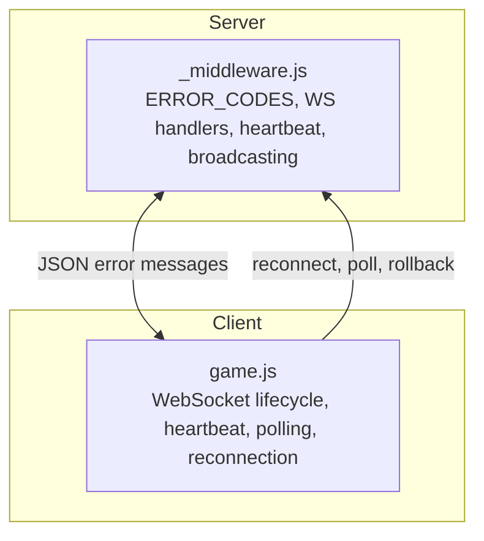
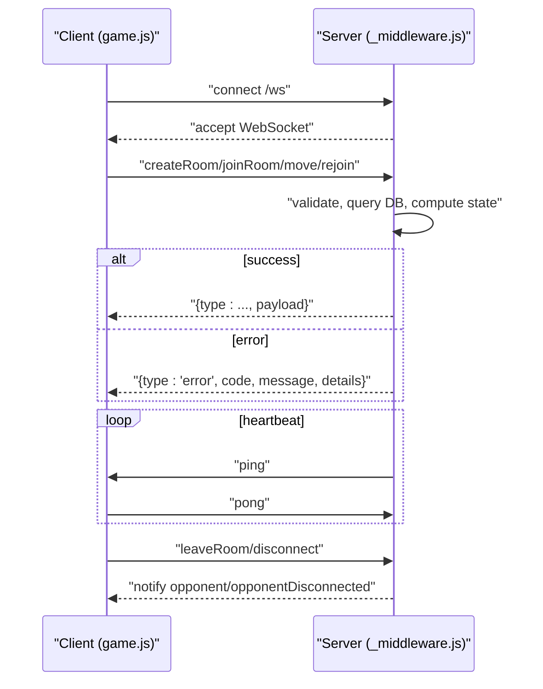
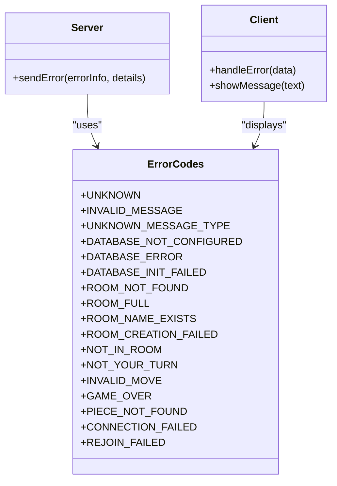
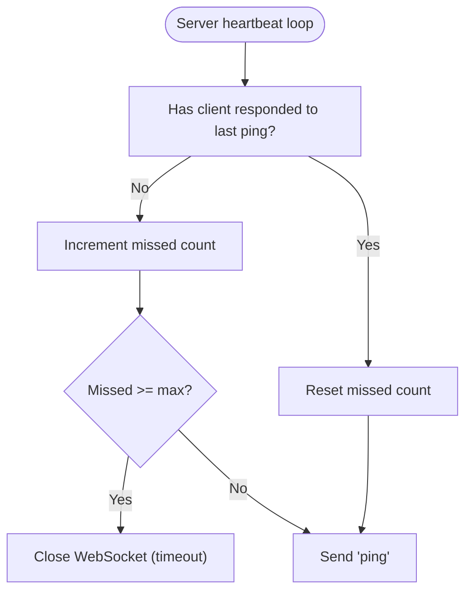
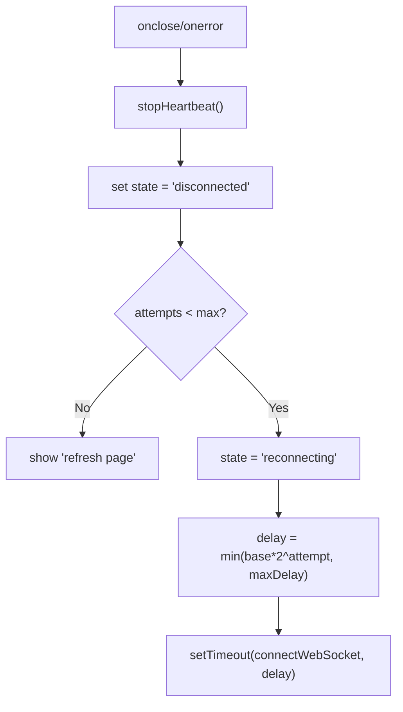
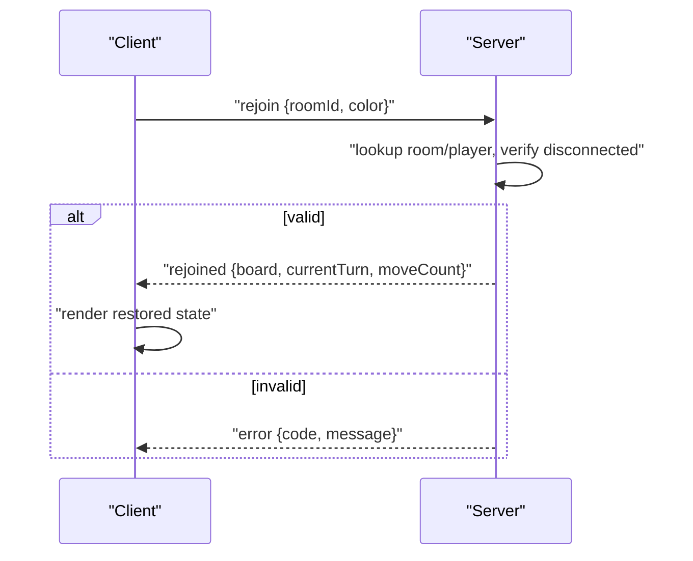
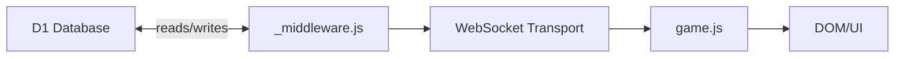

# Error Handling

<cite>
**Referenced Files in This Document**
- [_middleware.js](file://functions/_middleware.js)
- [game.js](file://game.js)
- [websocket.test.js](file://tests/integration/websocket.test.js)
- [reconnection.test.js](file://tests/unit/reconnection.test.js)
- [heartbeat.test.js](file://tests/unit/heartbeat.test.js)
- [TROUBLESHOOTING.md](file://TROUBLESHOOTING.md)
</cite>

## Table of Contents
1. [Introduction](#introduction)
2. [Project Structure](#project-structure)
3. [Core Components](#core-components)
4. [Architecture Overview](#architecture-overview)
5. [Detailed Component Analysis](#detailed-component-analysis)
6. [Dependency Analysis](#dependency-analysis)
7. [Performance Considerations](#performance-considerations)
8. [Troubleshooting Guide](#troubleshooting-guide)
9. [Conclusion](#conclusion)

## Introduction
This document provides a comprehensive guide to WebSocket error handling and recovery mechanisms in the Chinese Chess application. It documents the ERROR_CODES constants, error propagation patterns from server to client, client-side error handling strategies, timeout handling, connection failure recovery, graceful degradation, error message formatting, logging practices, debugging approaches, retry mechanisms with exponential backoff, and state reconciliation after errors.

## Project Structure
The error handling spans two primary areas:
- Server-side WebSocket handling and error propagation in the middleware
- Client-side WebSocket lifecycle, heartbeat, polling, and recovery in the frontend game logic

**Diagram sources**
- [_middleware.js](file://functions/_middleware.js)
- [game.js](file://game.js)

**Section sources**
- [_middleware.js](file://functions/_middleware.js)
- [game.js](file://game.js)

## Core Components
- ERROR_CODES: Centralized error definitions for general, database, room, game, and connection categories.
- Server-side message handling: Parses incoming messages, validates inputs, executes operations, and sends structured error responses.
- Client-side message handling: Processes server responses, displays user-friendly messages, and triggers recovery actions.
- Heartbeat and timeouts: Server pings with client-side timeout detection; both sides close or reconnect on timeouts.
- Broadcasting and cleanup: On disconnect, server notifies opponents and schedules cleanup.
- Reconnection: Client attempts exponential backoff; server enforces race-condition prevention during rejoin.

**Section sources**
- [_middleware.js](file://functions/_middleware.js)
- [game.js](file://game.js)

## Architecture Overview
The system uses a request-to-response model over WebSocket:
- Client connects to /ws and exchanges JSON messages.
- Server validates messages and database state, then responds with either success or error payloads.
- Client reacts to error payloads, performs retries/backoff, and restores state.

**Diagram sources**
- [_middleware.js](file://functions/_middleware.js)
- [game.js](file://game.js)

## Detailed Component Analysis

### Error Codes and Propagation
- ERROR_CODES defines numeric codes and messages for:
  - General: Unknown, Invalid message, Unknown message type
  - Database: Not configured, Operation failed, Init failed
  - Room: Not found, Full, Name exists, Creation failed
  - Game: Not in room, Not your turn, Invalid move, Game over, Piece not found
  - Connection: Connection failed, Rejoin failed
- Server sends structured error payloads with type "error", code, message, and optional details.
- Client displays user-friendly messages and triggers recovery.

**Diagram sources**
- [_middleware.js](file://functions/_middleware.js)
- [game.js](file://game.js)

**Section sources**
- [_middleware.js](file://functions/_middleware.js)
- [game.js](file://game.js)

### Timeout Handling and Heartbeat
- Server:
  - Periodic ping every heartbeat interval.
  - Closes connection with a timeout code if client does not respond within the timeout threshold.
- Client:
  - Tracks last heartbeat and missed count.
  - If too many heartbeats are missed, closes socket and attempts reconnection.

**Diagram sources**
- [_middleware.js](file://functions/_middleware.js)
- [game.js](file://game.js)

**Section sources**
- [_middleware.js](file://functions/_middleware.js)
- [game.js](file://game.js)
- [heartbeat.test.js](file://tests/unit/heartbeat.test.js)

### Connection Failure Recovery and Exponential Backoff
- Client:
  - On close/error, sets state to disconnected, stops heartbeat, and attempts reconnect.
  - Uses exponential backoff capped by a maximum delay.
  - Stops reconnecting after exceeding maximum attempts.
- Server:
  - Closes connection on timeout and cleans up timers and room state on close.

**Diagram sources**
- [game.js](file://game.js)

**Section sources**
- [game.js](file://game.js)
- [websocket.test.js](file://tests/integration/websocket.test.js)

### Graceful Degradation and Partial Failure Scenarios
- Client:
  - On move rejection, rolls back optimistic UI update and informs the user.
  - On opponent disconnect, shows a waiting message and continues polling.
  - On unknown message type, logs and ignores to avoid breaking the session.
- Server:
  - Validates inputs and database state; on failure, sends error payload and logs.
  - Broadcast errors are wrapped in try/catch to avoid crashing other clients.

**Section sources**
- [game.js](file://game.js)
- [_middleware.js](file://functions/_middleware.js)

### Error Message Formatting and Logging Practices
- Server error payload:
  - type: "error"
  - code: numeric code from ERROR_CODES
  - message: human-readable message
  - details: optional contextual details
- Logging:
  - Server logs initialization failures, message handling errors, and broadcast errors.
  - Client logs connection events, heartbeat misses, and error payloads.

**Section sources**
- [_middleware.js](file://functions/_middleware.js)
- [game.js](file://game.js)

### Debugging Approaches
- Browser console for client-side logs and WebSocket frames.
- Cloudflare Functions logs for server-side errors and operations.
- Troubleshooting guide provides step-by-step checks for D1, bindings, and connectivity.

**Section sources**
- [TROUBLESHOOTING.md](file://TROUBLESHOOTING.md)

### Retry Mechanisms and Circuit Breaker Patterns
- Retry:
  - Client uses exponential backoff with bounded jitter-like delays.
- Circuit breaker:
  - Client stops retrying after max attempts and prompts manual refresh.
  - Server closes dead connections proactively to free resources.

**Section sources**
- [game.js](file://game.js)
- [_middleware.js](file://functions/_middleware.js)

### Network Partition Handling and State Reconciliation
- Reconnection:
  - Client sends a rejoin message with room ID and color; server validates and restores state.
  - Race condition prevention: server checks if the original player is still connected before allowing rejoin.
- State reconciliation:
  - On rejoin, server returns board, current turn, and move count.
  - Client renders restored state and resumes normal operation.

**Diagram sources**
- [_middleware.js](file://functions/_middleware.js)
- [reconnection.test.js](file://tests/unit/reconnection.test.js)

**Section sources**
- [_middleware.js](file://functions/_middleware.js)
- [reconnection.test.js](file://tests/unit/reconnection.test.js)
- [game.js](file://game.js)

## Dependency Analysis
- Server depends on:
  - D1 database for room, player, and game state persistence.
  - In-memory connections map for per-instance WebSocket tracking.
- Client depends on:
  - WebSocket API for transport.
  - UI elements for status and messaging.

**Diagram sources**
- [_middleware.js](file://functions/_middleware.js)
- [game.js](file://game.js)

**Section sources**
- [_middleware.js](file://functions/_middleware.js)
- [game.js](file://game.js)

## Performance Considerations
- Heartbeat intervals and timeouts balance responsiveness and overhead.
- Broadcasting uses targeted loops with try/catch to avoid single-failure impact.
- Exponential backoff reduces server load during transient failures.

## Troubleshooting Guide
- Use the troubleshooting guide to verify D1 setup, bindings, and logs.
- Inspect browser console for WebSocket frames and client logs.
- Review Cloudflare Functions logs for server-side errors and initialization status.

**Section sources**
- [TROUBLESHOOTING.md](file://TROUBLESHOOTING.md)

## Conclusion
The system implements robust error handling and recovery across the WebSocket lifecycle. Centralized error codes, structured error payloads, heartbeat-driven timeouts, exponential backoff, and reconnection safeguards provide resilience against transient failures. State reconciliation ensures continuity after network partitions, while logging and diagnostics streamline troubleshooting.