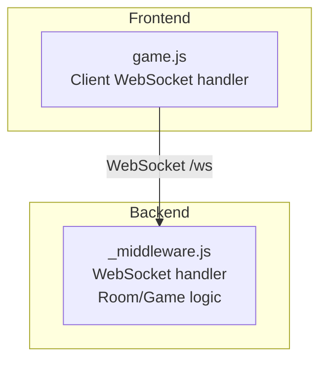
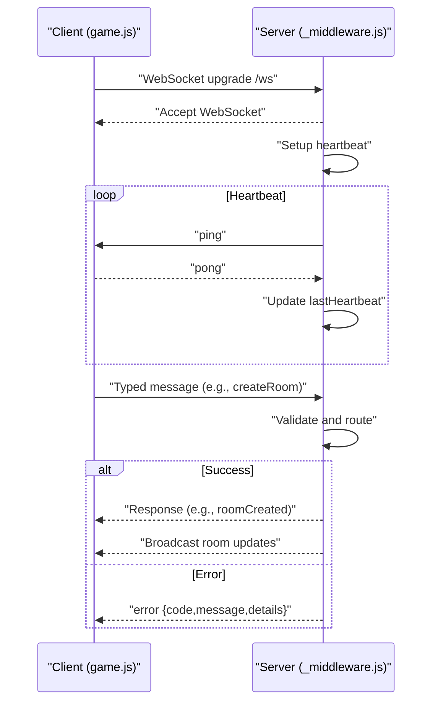
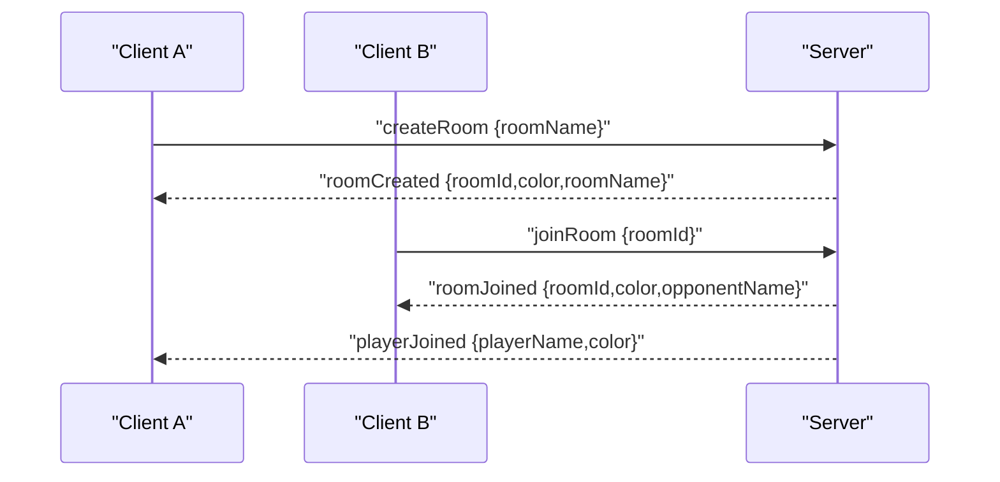
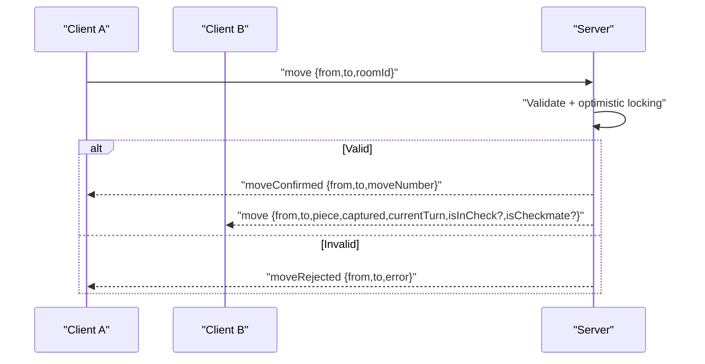
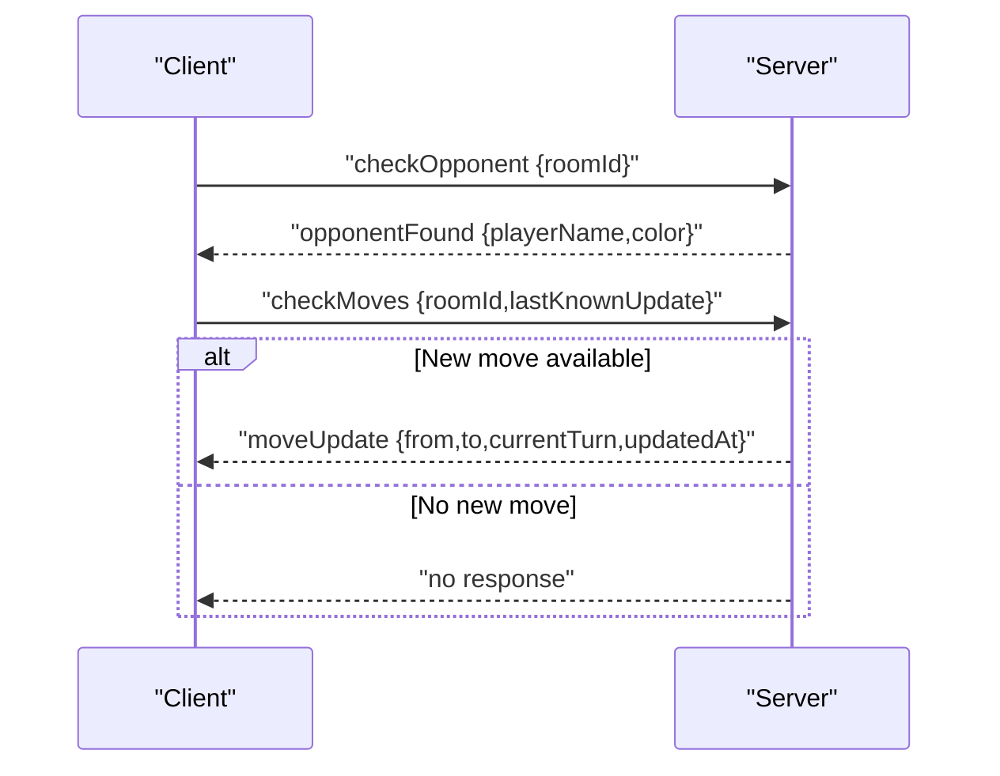
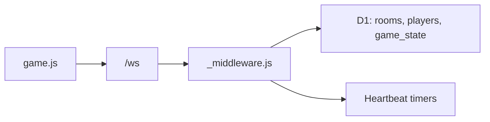

# Message Protocol

<cite>
**Referenced Files in This Document**
- [README.md](file://README.md)
- [_middleware.js](file://functions/_middleware.js)
- [game.js](file://game.js)
- [websocket.test.js](file://tests/integration/websocket.test.js)
- [reconnection.test.js](file://tests/unit/reconnection.test.js)
- [heartbeat.test.js](file://tests/unit/heartbeat.test.js)
- [game-flow.test.js](file://tests/integration/game-flow.test.js)
- [middleware-validation.test.js](file://tests/unit/middleware-validation.test.js)
</cite>

## Table of Contents
1. [Introduction](#introduction)
2. [Project Structure](#project-structure)
3. [Core Components](#core-components)
4. [Architecture Overview](#architecture-overview)
5. [Detailed Component Analysis](#detailed-component-analysis)
6. [Dependency Analysis](#dependency-analysis)
7. [Performance Considerations](#performance-considerations)
8. [Troubleshooting Guide](#troubleshooting-guide)
9. [Conclusion](#conclusion)

## Introduction
This document defines the WebSocket message protocol used by the Chinese Chess Online application. It covers all supported message types, their JSON schemas, routing behavior, validation rules, and error handling. It also documents client-server heartbeat behavior, reconnection semantics, and message ordering guarantees.

## Project Structure
The WebSocket protocol is implemented in the backend Cloudflare Pages Functions middleware and consumed by the frontend game logic. The tests provide integration and unit coverage for message handling, validation, and error scenarios.

**Diagram sources**
- [game.js:740-808](file://game.js#L740-L808)
- [_middleware.js:131-185](file://functions/_middleware.js#L131-L185)

**Section sources**
- [README.md:1-187](file://README.md#L1-L187)

## Core Components
- Client-side WebSocket handler: connects to /ws, sends/receives JSON messages, manages heartbeat, reconnection, and UI updates.
- Server-side WebSocket handler: upgrades requests, maintains connection state, routes messages to handlers, validates inputs, executes game logic, and broadcasts updates.

Key responsibilities:
- Message routing and dispatch based on type field.
- Input validation and error responses with structured error codes.
- Game state updates with optimistic locking.
- Broadcasting to room members and targeted responses.

**Section sources**
- [game.js:888-937](file://game.js#L888-L937)
- [_middleware.js:231-276](file://functions/_middleware.js#L231-L276)

## Architecture Overview
The WebSocket protocol follows a request-response and broadcast model:
- Clients send typed JSON messages to the server.
- Server validates, executes logic, and responds immediately or broadcasts to the room.
- Heartbeat ensures liveness; disconnect triggers cleanup and notifications.

**Diagram sources**
- [game.js:842-882](file://game.js#L842-L882)
- [_middleware.js:191-225](file://functions/_middleware.js#L191-L225)
- [_middleware.js:231-276](file://functions/_middleware.js#L231-L276)

## Detailed Component Analysis

### Message Types and Schemas

#### Client-to-Server Messages

- createRoom
  - Purpose: Create a new game room.
  - Fields:
    - type: "createRoom" (required)
    - roomName: string (required, non-empty, trimmed, max 20 chars)
  - Validation:
    - roomName must be present and non-empty.
    - Room name uniqueness is enforced; stale rooms cleaned up automatically.
  - Responses:
    - roomCreated: { type, roomId, color, roomName }
    - error: { type, code, message, details? }

- joinRoom
  - Purpose: Join an existing room by ID or name.
  - Fields:
    - type: "joinRoom" (required)
    - roomId: string (required, trimmed, max 20 chars)
  - Validation:
    - roomId must be present and non-empty.
    - Room must exist and not be full.
  - Responses:
    - roomJoined: { type, roomId, color, opponentName? }
    - playerJoined: { type, playerName?, color } (broadcast to opponent)
    - error: { type, code, message }

- leaveRoom
  - Purpose: Leave the current room.
  - Fields:
    - type: "leaveRoom" (required)
    - roomId: string (optional if connection state has roomId)
  - Behavior:
    - Marks player as disconnected in DB.
    - Broadcasts playerLeft to opponent.
    - Cleans up room if empty.
  - Responses:
    - leftRoom: { type } (acknowledgement)
    - playerLeft: { type, playerId } (broadcast)

- move
  - Purpose: Propose a move.
  - Fields:
    - type: "move" (required)
    - from: { row: number, col: number } (required)
    - to: { row: number, col: number } (required)
    - roomId: string (optional if connection state has roomId)
  - Validation:
    - Must be in a room.
    - Must be player’s turn and own piece.
    - Move must be valid according to game rules.
    - Optimistic locking via move_count prevents concurrent move conflicts.
  - Responses:
    - moveConfirmed: { type, from, to, moveNumber }
    - moveRejected: { type, from, to, error? }
    - move: { type, from, to, piece, captured?, currentTurn, isInCheck?, isCheckmate? } (broadcast)
    - gameOver: { type, winner, reason } (broadcast when finished)

- ping
  - Purpose: Heartbeat request.
  - Fields:
    - type: "ping" (required)
  - Behavior:
    - Server responds with pong and updates last heartbeat.

- rejoin
  - Purpose: Reconnect after disconnection.
  - Fields:
    - type: "rejoin" (required)
    - roomId: string (required)
    - color: "red" | "black" (required)
  - Validation:
    - Original player must be disconnected to prevent race conditions.
  - Responses:
    - rejoined: { type, roomId, color, board, currentTurn, moveCount }
    - error: { type, code, message }

- checkOpponent
  - Purpose: Poll for opponent presence.
  - Fields:
    - type: "checkOpponent" (required)
    - roomId: string (required)
  - Response:
    - opponentFound: { type, playerName?, color } (sent to requester)

- checkMoves
  - Purpose: Poll for new moves since lastKnownUpdate.
  - Fields:
    - type: "checkMoves" (required)
    - roomId: string (required)
    - lastKnownUpdate: number (required)
  - Response:
    - moveUpdate: { type, from, to, currentTurn, updatedAt }

- getGameState
  - Purpose: Request current game state snapshot.
  - Fields:
    - type: "getGameState" (required)
    - roomId: string (required)
  - Response:
    - gameState: { type, board, currentTurn, moveCount, lastMove? }

- resign
  - Purpose: Resign from the game.
  - Fields:
    - type: "resign" (required)
    - roomId: string (optional if connection state has roomId)
  - Response:
    - resigned: { type } (sender)
    - gameOver: { type, winner, reason: "resign", resignedBy } (broadcast)

#### Server-to-Client Messages

- roomCreated
  - Fields: { type, roomId, color, roomName }
  - Emitted after successful createRoom.

- roomJoined
  - Fields: { type, roomId, color, opponentName? }
  - Emitted after successful joinRoom.

- playerJoined
  - Fields: { type, playerName?, color }
  - Broadcast to opponent when a player joins.

- playerLeft
  - Fields: { type, playerId }
  - Broadcast to opponent when a player leaves.

- move
  - Fields: { type, from, to, piece, captured?, currentTurn, isInCheck?, isCheckmate? }
  - Broadcast to opponent after a valid move.

- moveConfirmed
  - Fields: { type, from, to, moveNumber }
  - Confirms the move was accepted and persisted.

- moveRejected
  - Fields: { type, from, to, error? }
  - Indicates the move was rejected (invalid, not your turn, concurrent conflict, etc.).

- moveUpdate
  - Fields: { type, from, to, currentTurn, updatedAt }
  - Sent to requester when a newer move is available.

- gameState
  - Fields: { type, board, currentTurn, moveCount, lastMove? }
  - Sent upon getGameState.

- gameOver
  - Fields: { type, winner, reason }
  - reason can be "capture", "checkmate", or "resign".

- rejoined
  - Fields: { type, roomId, color, board, currentTurn, moveCount }
  - Sent after successful rejoin.

- error
  - Fields: { type, code, message, details? }
  - Standardized error envelope for all failures.

- pong
  - Fields: { type: "pong" }
  - Responds to ping.

- opponentFound
  - Fields: { type, playerName?, color }
  - Sent to requester when opponent is present.

- opponentDisconnected
  - Fields: { type, playerId }
  - Broadcast to opponent when a player disconnects.

**Section sources**
- [_middleware.js:242-276](file://functions/_middleware.js#L242-L276)
- [_middleware.js:282-351](file://functions/_middleware.js#L282-L351)
- [_middleware.js:353-443](file://functions/_middleware.js#L353-L443)
- [_middleware.js:445-477](file://functions/_middleware.js#L445-L477)
- [_middleware.js:522-683](file://functions/_middleware.js#L522-L683)
- [_middleware.js:685-707](file://functions/_middleware.js#L685-L707)
- [_middleware.js:709-749](file://functions/_middleware.js#L709-L749)
- [_middleware.js:1086-1146](file://functions/_middleware.js#L1086-L1146)
- [_middleware.js:1148-1183](file://functions/_middleware.js#L1148-L1183)
- [_middleware.js:1185-1211](file://functions/_middleware.js#L1185-L1211)
- [game.js:888-937](file://game.js#L888-L937)
- [game.js:891-936](file://game.js#L891-L936)

### Message Routing Patterns
- Route by data.type in handleMessage.
- Room-scoped broadcasts via broadcastToRoom excluding sender.
- Targeted responses for polling and rejoin.

**Section sources**
- [_middleware.js:231-276](file://functions/_middleware.js#L231-L276)
- [_middleware.js:1242-1252](file://functions/_middleware.js#L1242-L1252)

### Parameter Validation
- Room name: non-empty, trimmed, max 20 chars.
- Room ID: non-empty, trimmed, max 20 chars.
- Move: piece ownership, turn enforcement, rule validation, optimistic locking.
- Rejoin: original player must be disconnected.

**Section sources**
- [_middleware.js:291-297](file://functions/_middleware.js#L291-L297)
- [_middleware.js:357-372](file://functions/_middleware.js#L357-L372)
- [_middleware.js:522-583](file://functions/_middleware.js#L522-L583)
- [_middleware.js:1086-1111](file://functions/_middleware.js#L1086-L1111)
- [middleware-validation.test.js:71-123](file://tests/unit/middleware-validation.test.js#L71-L123)

### Response Formats
- Immediate responses per request (e.g., roomCreated, roomJoined, moveConfirmed, moveRejected, gameState, resigned).
- Broadcasts for room-wide events (move, playerJoined, playerLeft, gameOver).
- Polling responses (moveUpdate) for incremental state.

**Section sources**
- [_middleware.js:339-344](file://functions/_middleware.js#L339-L344)
- [_middleware.js:414-419](file://functions/_middleware.js#L414-L419)
- [_middleware.js:646-663](file://functions/_middleware.js#L646-L663)
- [_middleware.js:666-672](file://functions/_middleware.js#L666-L672)
- [_middleware.js:1198-1207](file://functions/_middleware.js#L1198-L1207)

### Practical Message Exchanges

#### Example: Create and Join Room

**Diagram sources**
- [_middleware.js:339-344](file://functions/_middleware.js#L339-L344)
- [_middleware.js:414-419](file://functions/_middleware.js#L414-L419)
- [_middleware.js:422-436](file://functions/_middleware.js#L422-L436)

#### Example: Move Execution and Broadcast

**Diagram sources**
- [_middleware.js:646-663](file://functions/_middleware.js#L646-L663)
- [_middleware.js:676-682](file://functions/_middleware.js#L676-L682)

#### Example: Polling for Updates

**Diagram sources**
- [_middleware.js:1148-1183](file://functions/_middleware.js#L1148-L1183)
- [_middleware.js:1185-1211](file://functions/_middleware.js#L1185-L1211)

### Error Message Formats and Codes
- error envelope: { type, code, message, details? }
- Error codes:
  - UNKNOWN: 1000
  - INVALID_MESSAGE: 1001
  - UNKNOWN_MESSAGE_TYPE: 1002
  - DATABASE_NOT_CONFIGURED: 2000
  - DATABASE_ERROR: 2001
  - DATABASE_INIT_FAILED: 2002
  - ROOM_NOT_FOUND: 3000
  - ROOM_FULL: 3001
  - ROOM_NAME_EXISTS: 3002
  - ROOM_CREATION_FAILED: 3003
  - NOT_IN_ROOM: 4000
  - NOT_YOUR_TURN: 4001
  - INVALID_MOVE: 4002
  - GAME_OVER: 4003
  - PIECE_NOT_FOUND: 4004
  - CONNECTION_FAILED: 5000
  - REJOIN_FAILED: 5001

**Section sources**
- [_middleware.js:13-40](file://functions/_middleware.js#L13-L40)
- [_middleware.js:1254-1261](file://functions/_middleware.js#L1254-L1261)

### Message Ordering Guarantees, Duplicate Detection, and Acknowledgments
- Ordering:
  - Moves are processed sequentially per room with optimistic locking to prevent conflicts.
  - Broadcast order is best-effort; clients should rely on updatedAt timestamps for ordering.
- Duplicate detection:
  - Optimistic locking uses move_count to detect concurrent moves and reject conflicting updates.
  - Clients can use moveUpdate with updatedAt to ignore stale updates.
- Acknowledgments:
  - moveConfirmed confirms acceptance.
  - moveRejected indicates rejection with error details.
  - getGameState returns a snapshot for reconciliation.

**Section sources**
- [_middleware.js:619-634](file://functions/_middleware.js#L619-L634)
- [_middleware.js:1185-1211](file://functions/_middleware.js#L1185-L1211)
- [middleware-validation.test.js:207-221](file://tests/unit/middleware-validation.test.js#L207-L221)

## Dependency Analysis
- Frontend depends on WebSocket endpoint /ws and game.js handlers.
- Backend depends on D1 database for rooms, players, and game_state tables.
- Heartbeat timers enforce liveness and detect dead connections.

**Diagram sources**
- [game.js:740-808](file://game.js#L740-L808)
- [_middleware.js:131-185](file://functions/_middleware.js#L131-L185)
- [_middleware.js:191-225](file://functions/_middleware.js#L191-L225)

**Section sources**
- [_middleware.js:46-98](file://functions/_middleware.js#L46-L98)

## Performance Considerations
- Heartbeat interval: server pings every 30 seconds; client expects pong within 20 seconds, allowing up to 3 missed heartbeats before reconnect.
- Polling: checkOpponent polls every 2 seconds; checkMoves polls every 3 seconds to reduce load.
- Optimistic locking minimizes contention and avoids unnecessary retries.

[No sources needed since this section provides general guidance]

## Troubleshooting Guide
Common issues and resolutions:
- Unknown message type: Ensure type is one of supported values.
- Invalid move: Verify piece ownership, turn, and move validity.
- Concurrent move detected: Refresh game state and retry.
- Room not found or full: Validate roomId and room status.
- Rejoin failure: Original player must be disconnected.

**Section sources**
- [_middleware.js:273-275](file://functions/_middleware.js#L273-L275)
- [_middleware.js:522-583](file://functions/_middleware.js#L522-L583)
- [_middleware.js:619-634](file://functions/_middleware.js#L619-L634)
- [_middleware.js:1086-1111](file://functions/_middleware.js#L1086-L1111)
- [websocket.test.js:314-342](file://tests/integration/websocket.test.js#L314-L342)
- [reconnection.test.js:191-211](file://tests/unit/reconnection.test.js#L191-L211)

## Conclusion
The WebSocket protocol provides a robust, validated, and resilient communication channel for Chinese Chess Online. It enforces turn-based play, detects and resolves concurrency, and offers reconnection with state recovery. Clients should implement heartbeat, polling, and optimistic locking-aware update logic to ensure correctness and resilience.