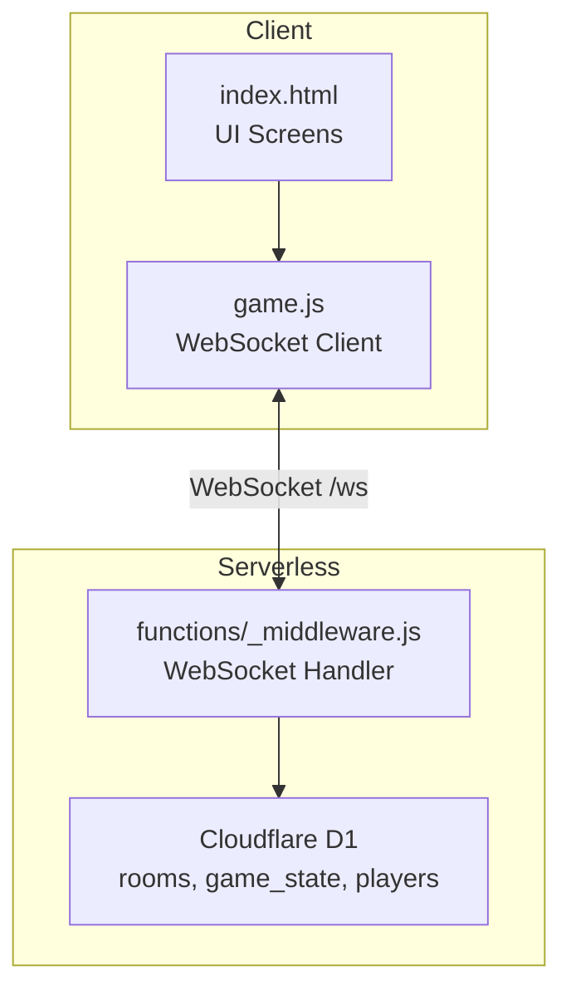
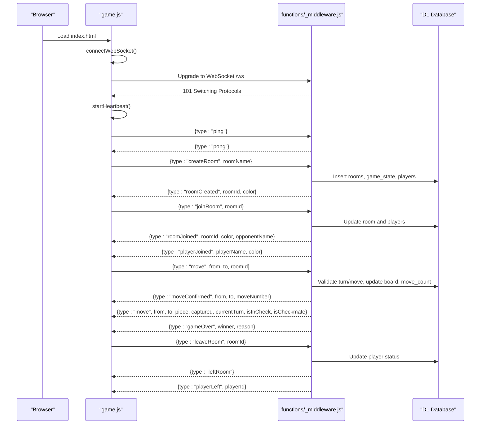
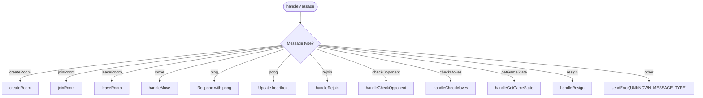
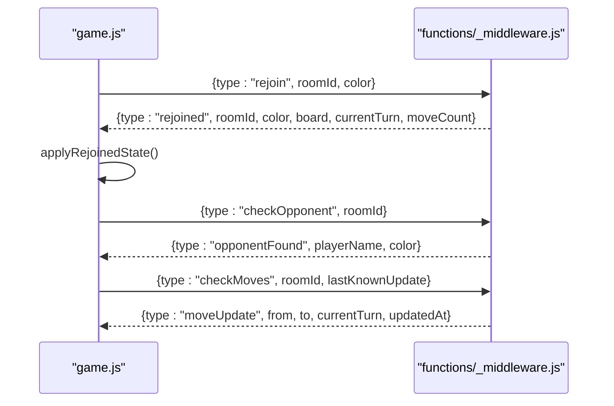
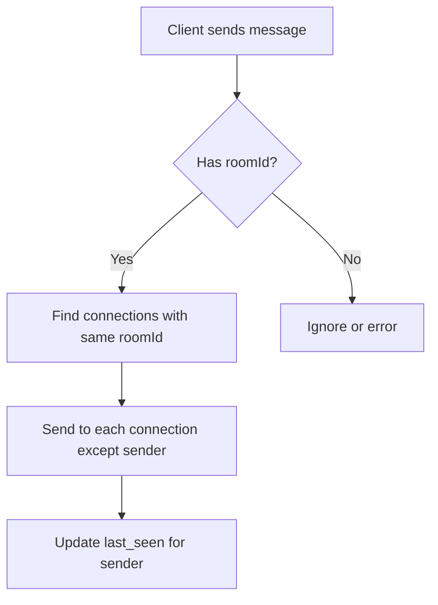
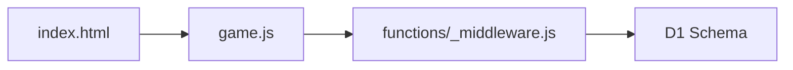
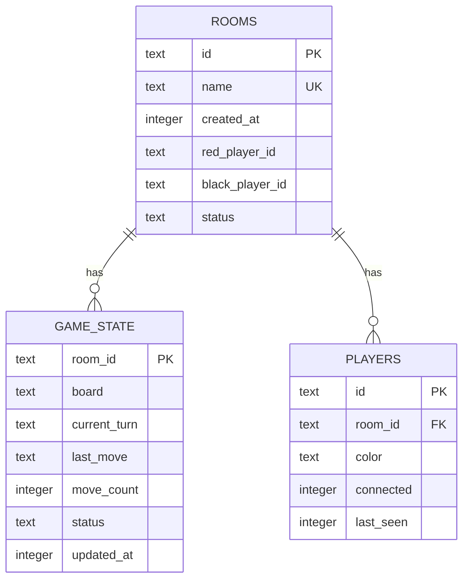

# WebSocket Communication

<cite>
**Referenced Files in This Document**
- [functions/_middleware.js](file://functions/_middleware.js)
- [game.js](file://game.js)
- [index.html](file://index.html)
- [schema.sql](file://schema.sql)
- [wrangler.toml](file://wrangler.toml)
- [tests/integration/websocket.test.js](file://tests/integration/websocket.test.js)
- [tests/unit/heartbeat.test.js](file://tests/unit/heartbeat.test.js)
- [tests/unit/reconnection.test.js](file://tests/unit/reconnection.test.js)
</cite>

## Table of Contents
1. [Introduction](#introduction)
2. [Project Structure](#project-structure)
3. [Core Components](#core-components)
4. [Architecture Overview](#architecture-overview)
5. [Detailed Component Analysis](#detailed-component-analysis)
6. [Dependency Analysis](#dependency-analysis)
7. [Performance Considerations](#performance-considerations)
8. [Troubleshooting Guide](#troubleshooting-guide)
9. [Conclusion](#conclusion)
10. [Appendices](#appendices)

## Introduction
This document describes the WebSocket communication system for the Chinese Chess game. It covers the complete message protocol, connection lifecycle, heartbeat monitoring, automatic reconnection, room-based message routing, error handling, timeouts, and state synchronization. It also documents client-side and server-side implementations, security considerations, rate limiting, connection limits, and debugging tools.

## Project Structure
The WebSocket system spans the frontend client and the backend serverless function:
- Frontend: game.js implements the client-side WebSocket logic, UI integration, heartbeat, reconnection, and room polling.
- Backend: functions/_middleware.js implements the WebSocket upgrade, connection management, message routing, room management, game logic, broadcasting, and error handling.
- Database: Cloudflare D1 tables define rooms, game_state, and players with indexes for performance.
- Deployment: wrangler.toml configures Pages, D1 binding, and routes.

**Diagram sources**
- [index.html:10-58](file://index.html#L10-L58)
- [game.js:740-808](file://game.js#L740-L808)
- [functions/_middleware.js:131-185](file://functions/_middleware.js#L131-L185)
- [schema.sql:5-42](file://schema.sql#L5-L42)

**Section sources**
- [index.html:10-58](file://index.html#L10-L58)
- [game.js:740-808](file://game.js#L740-L808)
- [functions/_middleware.js:131-185](file://functions/_middleware.js#L131-L185)
- [schema.sql:5-42](file://schema.sql#L5-L42)

## Core Components
- Server WebSocket handler: Accepts upgrades, manages connections, handles messages, and broadcasts room events.
- Client WebSocket client: Manages connection state, heartbeat, reconnection, and UI updates.
- Room management: Creates, joins, leaves rooms, and cleans up stale rooms.
- Game logic: Validates moves, applies state changes, and broadcasts updates.
- Broadcasting: Sends room-wide updates to connected players.
- Error handling: Centralized error codes and structured error messages.

**Section sources**
- [functions/_middleware.js:131-185](file://functions/_middleware.js#L131-L185)
- [functions/_middleware.js:231-276](file://functions/_middleware.js#L231-L276)
- [functions/_middleware.js:1242-1252](file://functions/_middleware.js#L1242-L1252)
- [game.js:888-937](file://game.js#L888-L937)

## Architecture Overview
The WebSocket endpoint is /ws. Clients connect, optionally rejoin a room, and receive real-time updates. The server maintains in-memory connection metadata and persists game state in D1.

**Diagram sources**
- [game.js:740-808](file://game.js#L740-L808)
- [functions/_middleware.js:131-185](file://functions/_middleware.js#L131-L185)
- [functions/_middleware.js:282-351](file://functions/_middleware.js#L282-L351)
- [functions/_middleware.js:353-443](file://functions/_middleware.js#L353-L443)
- [functions/_middleware.js:522-683](file://functions/_middleware.js#L522-L683)
- [functions/_middleware.js:445-477](file://functions/_middleware.js#L445-L477)

## Detailed Component Analysis

### Server WebSocket Handler
- Connection lifecycle:
  - Upgrade request accepted via WebSocketPair.
  - Connection stored in memory with roomId, playerId, color, heartbeat tracking.
  - Heartbeat setup every 30 seconds; timeout after 90 seconds.
  - On close/error, clean up connections and notify opponents.
- Message routing:
  - Handles createRoom, joinRoom, leaveRoom, move, ping, pong, rejoin, checkOpponent, checkMoves, getGameState, resign.
  - Broadcasts room events to all players except sender.
- Room management:
  - Enforces room name uniqueness and cleanup of stale rooms.
  - Prevents joining finished rooms and full rooms.
- Game logic:
  - Optimistic locking via move_count to prevent concurrent move conflicts.
  - Validates turns and moves against chess rules.
  - Broadcasts move updates and game over events.

**Diagram sources**
- [functions/_middleware.js:231-276](file://functions/_middleware.js#L231-L276)
- [functions/_middleware.js:1254-1261](file://functions/_middleware.js#L1254-L1261)

**Section sources**
- [functions/_middleware.js:131-185](file://functions/_middleware.js#L131-L185)
- [functions/_middleware.js:191-225](file://functions/_middleware.js#L191-L225)
- [functions/_middleware.js:231-276](file://functions/_middleware.js#L231-L276)
- [functions/_middleware.js:282-351](file://functions/_middleware.js#L282-L351)
- [functions/_middleware.js:353-443](file://functions/_middleware.js#L353-L443)
- [functions/_middleware.js:445-477](file://functions/_middleware.js#L445-L477)
- [functions/_middleware.js:522-683](file://functions/_middleware.js#L522-L683)
- [functions/_middleware.js:1086-1146](file://functions/_middleware.js#L1086-L1146)
- [functions/_middleware.js:1148-1211](file://functions/_middleware.js#L1148-L1211)
- [functions/_middleware.js:1213-1240](file://functions/_middleware.js#L1213-L1240)
- [functions/_middleware.js:1242-1252](file://functions/_middleware.js#L1242-L1252)

### Client WebSocket Client
- Connection management:
  - Connects to /ws with wss if HTTPS, otherwise ws.
  - Tracks connection state: disconnected, connecting, connected, reconnecting.
  - Attempts exponential backoff reconnection up to a maximum delay.
- Heartbeat:
  - Sends ping every 20 seconds; expects pong.
  - If 3 consecutive pings are missed, closes connection and attempts reconnection.
- Room actions:
  - createRoom, joinRoom, leaveRoom messages.
  - Polling for opponent presence and move updates when needed.
- Message handling:
  - Updates UI state, renders board, handles game over, and rollbacks rejected moves.
  - Responds to ping with pong and updates heartbeat.

**Diagram sources**
- [game.js:888-937](file://game.js#L888-L937)
- [game.js:1075-1123](file://game.js#L1075-L1123)
- [game.js:1170-1234](file://game.js#L1170-L1234)
- [functions/_middleware.js:1086-1146](file://functions/_middleware.js#L1086-L1146)
- [functions/_middleware.js:1148-1211](file://functions/_middleware.js#L1148-L1211)

**Section sources**
- [game.js:740-808](file://game.js#L740-L808)
- [game.js:810-836](file://game.js#L810-L836)
- [game.js:842-882](file://game.js#L842-L882)
- [game.js:888-937](file://game.js#L888-L937)
- [game.js:1075-1123](file://game.js#L1075-L1123)
- [game.js:1170-1234](file://game.js#L1170-L1234)

### Message Protocol and Event Types
- Connection and lifecycle:
  - Upgrade to WebSocket at /ws.
  - ping/pong for heartbeat.
  - close codes: 1000 normal, 1001 timeout.
- Room management:
  - createRoom: { type: "createRoom", roomName } -> { type: "roomCreated", roomId, color, roomName }
  - joinRoom: { type: "joinRoom", roomId } -> { type: "roomJoined", roomId, color, opponentName }
  - leaveRoom: { type: "leaveRoom", roomId } -> { type: "leftRoom" }
- Game actions:
  - move: { type: "move", from, to, roomId } -> { type: "moveConfirmed" | "moveRejected" }, broadcast { type: "move", ... }
  - resign: { type: "resign", roomId } -> { type: "resigned" }, broadcast { type: "gameOver", reason:"resign", ... }
  - getGameState: { type: "getGameState", roomId } -> { type: "gameState", board, currentTurn, moveCount, lastMove }
- Reconnection:
  - rejoin: { type: "rejoin", roomId, color } -> { type: "rejoined", ... }
  - checkOpponent: { type: "checkOpponent", roomId } -> { type: "opponentFound", ... }
  - checkMoves: { type: "checkMoves", roomId, lastKnownUpdate } -> { type: "moveUpdate", ... }
- Errors:
  - { type: "error", code, message, details? }

**Section sources**
- [functions/_middleware.js:231-276](file://functions/_middleware.js#L231-L276)
- [functions/_middleware.js:282-351](file://functions/_middleware.js#L282-L351)
- [functions/_middleware.js:353-443](file://functions/_middleware.js#L353-L443)
- [functions/_middleware.js:522-683](file://functions/_middleware.js#L522-L683)
- [functions/_middleware.js:1086-1146](file://functions/_middleware.js#L1086-L1146)
- [functions/_middleware.js:1148-1211](file://functions/_middleware.js#L1148-L1211)
- [functions/_middleware.js:1254-1261](file://functions/_middleware.js#L1254-L1261)
- [tests/integration/websocket.test.js:69-125](file://tests/integration/websocket.test.js#L69-L125)
- [tests/integration/websocket.test.js:127-226](file://tests/integration/websocket.test.js#L127-L226)
- [tests/integration/websocket.test.js:228-277](file://tests/integration/websocket.test.js#L228-L277)
- [tests/integration/websocket.test.js:279-305](file://tests/integration/websocket.test.js#L279-L305)
- [tests/integration/websocket.test.js:344-377](file://tests/integration/websocket.test.js#L344-L377)
- [tests/integration/websocket.test.js:379-403](file://tests/integration/websocket.test.js#L379-L403)

### Room-Based Message Routing
- Room membership is tracked per connection and persisted in D1.
- broadcastToRoom sends messages to all connections in the same room, excluding the sender.
- Room cleanup occurs when no players remain connected.

**Diagram sources**
- [functions/_middleware.js:1242-1252](file://functions/_middleware.js#L1242-L1252)
- [functions/_middleware.js:1213-1240](file://functions/_middleware.js#L1213-L1240)

**Section sources**
- [functions/_middleware.js:1242-1252](file://functions/_middleware.js#L1242-L1252)
- [functions/_middleware.js:1213-1240](file://functions/_middleware.js#L1213-L1240)

### Error Handling and Timeouts
- Server-side error codes enumerate general, database, room, game, and connection errors.
- Heartbeat timeout triggers connection close with code 1001.
- Client-side missed heartbeat threshold triggers reconnection.
- Graceful disconnection updates player status and notifies opponents.

**Section sources**
- [functions/_middleware.js:13-40](file://functions/_middleware.js#L13-L40)
- [functions/_middleware.js:191-225](file://functions/_middleware.js#L191-L225)
- [functions/_middleware.js:1213-1240](file://functions/_middleware.js#L1213-L1240)
- [tests/unit/heartbeat.test.js:117-145](file://tests/unit/heartbeat.test.js#L117-L145)
- [tests/unit/heartbeat.test.js:271-313](file://tests/unit/heartbeat.test.js#L271-L313)

### Security Considerations, Rate Limiting, and Connection Limits
- Transport security:
  - Uses wss when served over HTTPS.
- Input validation:
  - Room names are trimmed and length-limited.
  - Room identifiers are trimmed and length-limited.
  - JSON parsing with error handling prevents malformed message crashes.
- Race condition prevention:
  - Rejoin requires the original player to be disconnected.
- Database constraints:
  - Unique room names, foreign keys, and indexes improve integrity and performance.
- Connection limits:
  - No explicit per-IP or per-room concurrency limit in code; consider adding rate limiting at the edge if needed.

**Section sources**
- [game.js:748-749](file://game.js#L748-L749)
- [functions/_middleware.js:291-297](file://functions/_middleware.js#L291-L297)
- [functions/_middleware.js:369-372](file://functions/_middleware.js#L369-L372)
- [functions/_middleware.js:1107-1111](file://functions/_middleware.js#L1107-L1111)
- [schema.sql:5-42](file://schema.sql#L5-L42)

### Debugging Tools and Monitoring Approaches
- Logging:
  - Server logs connection events, heartbeat, room operations, and errors.
  - Client logs connection state, reconnection attempts, and message handling.
- Testing:
  - Integration tests cover WebSocket lifecycle, room creation/joining, move synchronization, heartbeat, error handling, reconnection, and disconnection.
  - Unit tests validate heartbeat timing, timeout detection, and reconnection logic.
- UI indicators:
  - Connection status and messages displayed to users.

**Section sources**
- [functions/_middleware.js:157-158](file://functions/_middleware.js#L157-L158)
- [functions/_middleware.js:173-174](file://functions/_middleware.js#L173-L174)
- [functions/_middleware.js:191-225](file://functions/_middleware.js#L191-L225)
- [game.js:888-937](file://game.js#L888-L937)
- [tests/integration/websocket.test.js:33-67](file://tests/integration/websocket.test.js#L33-L67)
- [tests/unit/heartbeat.test.js:147-207](file://tests/unit/heartbeat.test.js#L147-L207)
- [tests/unit/reconnection.test.js:139-278](file://tests/unit/reconnection.test.js#L139-L278)

## Dependency Analysis
- Client depends on:
  - game.js for WebSocket logic and UI.
  - index.html for DOM screens and event wiring.
- Server depends on:
  - Cloudflare Pages runtime for WebSocket upgrade.
  - D1 for persistent room, game state, and player data.
- Internal dependencies:
  - Message handlers depend on database operations and broadcast utilities.

**Diagram sources**
- [index.html:10-58](file://index.html#L10-L58)
- [game.js:740-808](file://game.js#L740-L808)
- [functions/_middleware.js:131-185](file://functions/_middleware.js#L131-L185)
- [schema.sql:5-42](file://schema.sql#L5-L42)

**Section sources**
- [index.html:10-58](file://index.html#L10-L58)
- [game.js:740-808](file://game.js#L740-L808)
- [functions/_middleware.js:131-185](file://functions/_middleware.js#L131-L185)
- [schema.sql:5-42](file://schema.sql#L5-L42)

## Performance Considerations
- Database indexing:
  - Indexes on rooms(name), rooms(status), players(room_id), and game_state(updated_at) optimize lookups.
- Optimistic locking:
  - move_count prevents concurrent move conflicts and reduces contention.
- Broadcasting:
  - Room-wide updates iterate connections; consider scaling if many players per room.
- Heartbeat:
  - 30-second intervals balance responsiveness and overhead.

[No sources needed since this section provides general guidance]

## Troubleshooting Guide
- Connection fails:
  - Verify HTTPS vs ws usage and that /ws is reachable.
  - Check server logs for upgrade failures.
- Frequent timeouts:
  - Ensure clients send pong responses; adjust heartbeat thresholds if needed.
- Stale rooms:
  - Rooms are cleaned up after 5 minutes of inactivity; verify cleanup logic.
- Reconnection issues:
  - Ensure original player is disconnected before rejoining; verify color and room existence.

**Section sources**
- [functions/_middleware.js:131-185](file://functions/_middleware.js#L131-L185)
- [functions/_middleware.js:191-225](file://functions/_middleware.js#L191-L225)
- [functions/_middleware.js:479-497](file://functions/_middleware.js#L479-L497)
- [functions/_middleware.js:1107-1111](file://functions/_middleware.js#L1107-L1111)

## Conclusion
The WebSocket system provides robust real-time communication for room-based Chinese Chess gameplay. It includes heartbeat monitoring, automatic reconnection, room management, and broadcast messaging. The server enforces integrity via database constraints and optimistic locking, while the client ensures resilience through exponential backoff and polling fallbacks. With logging, testing, and UI indicators, the system is well-equipped for debugging and monitoring.

## Appendices

### API Definitions

- WebSocket Endpoint
  - Path: /ws
  - Upgrade header: websocket
  - Transport: wss on HTTPS, ws on HTTP

- Message Types

  - createRoom
    - Request: { type: "createRoom", roomName }
    - Response: { type: "roomCreated", roomId, color, roomName }

  - joinRoom
    - Request: { type: "joinRoom", roomId }
    - Response: { type: "roomJoined", roomId, color, opponentName }

  - leaveRoom
    - Request: { type: "leaveRoom", roomId }
    - Response: { type: "leftRoom" }

  - move
    - Request: { type: "move", from, to, roomId }
    - Responses:
      - { type: "moveConfirmed", from, to, moveNumber }
      - { type: "moveRejected", from, to, error? }
      - Broadcast: { type: "move", from, to, piece, captured, currentTurn, isInCheck, isCheckmate }
      - Broadcast: { type: "gameOver", winner, reason }

  - ping/pong
    - Request: { type: "ping" }
    - Response: { type: "pong" }

  - rejoin
    - Request: { type: "rejoin", roomId, color }
    - Response: { type: "rejoined", roomId, color, board, currentTurn, moveCount }

  - checkOpponent
    - Request: { type: "checkOpponent", roomId }
    - Response: { type: "opponentFound", playerName, color }

  - checkMoves
    - Request: { type: "checkMoves", roomId, lastKnownUpdate }
    - Response: { type: "moveUpdate", from, to, currentTurn, updatedAt }

  - getGameState
    - Request: { type: "getGameState", roomId }
    - Response: { type: "gameState", board, currentTurn, moveCount, lastMove }

  - resign
    - Request: { type: "resign", roomId }
    - Response: { type: "resigned" }
    - Broadcast: { type: "gameOver", winner, reason:"resign", resignedBy }

  - error
    - Response: { type: "error", code, message, details? }

- Connection States
  - Client: disconnected, connecting, connected, reconnecting
  - Close codes: 1000 normal, 1001 timeout

- Heartbeat
  - Server interval: 30 seconds, timeout: 90 seconds
  - Client interval: 20 seconds, max missed: 3

- Reconnection
  - Exponential backoff up to 30 seconds
  - Original player must be disconnected before rejoin

**Section sources**
- [functions/_middleware.js:231-276](file://functions/_middleware.js#L231-L276)
- [functions/_middleware.js:282-351](file://functions/_middleware.js#L282-L351)
- [functions/_middleware.js:353-443](file://functions/_middleware.js#L353-L443)
- [functions/_middleware.js:522-683](file://functions/_middleware.js#L522-L683)
- [functions/_middleware.js:1086-1146](file://functions/_middleware.js#L1086-L1146)
- [functions/_middleware.js:1148-1211](file://functions/_middleware.js#L1148-L1211)
- [functions/_middleware.js:1254-1261](file://functions/_middleware.js#L1254-L1261)
- [functions/_middleware.js:191-225](file://functions/_middleware.js#L191-L225)
- [game.js:842-882](file://game.js#L842-L882)
- [tests/integration/websocket.test.js:69-125](file://tests/integration/websocket.test.js#L69-L125)
- [tests/integration/websocket.test.js:127-226](file://tests/integration/websocket.test.js#L127-L226)
- [tests/integration/websocket.test.js:228-277](file://tests/integration/websocket.test.js#L228-L277)
- [tests/integration/websocket.test.js:279-305](file://tests/integration/websocket.test.js#L279-L305)
- [tests/integration/websocket.test.js:344-377](file://tests/integration/websocket.test.js#L344-L377)
- [tests/integration/websocket.test.js:379-403](file://tests/integration/websocket.test.js#L379-L403)

### Database Schema

**Diagram sources**
- [schema.sql:5-42](file://schema.sql#L5-L42)

**Section sources**
- [schema.sql:5-42](file://schema.sql#L5-L42)

### Deployment Configuration
- Pages build output directory: public
- D1 binding: DB
- Database name and ID configured for chinachess

**Section sources**
- [wrangler.toml:10-17](file://wrangler.toml#L10-L17)